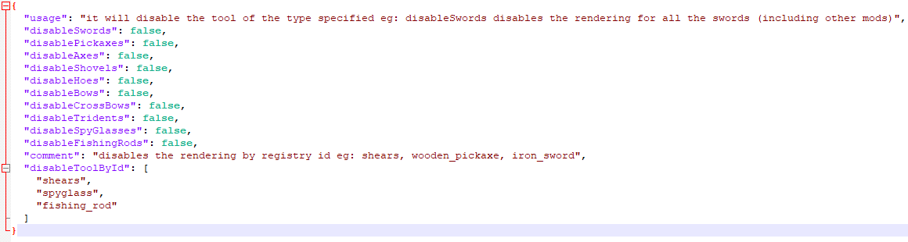

# BackTools

A Fabric mod that renders the last used tool in player's back and other clients are able to see it.
You can change any orientation or disable any tool in the config file.

## Config File
You can disable the render of an item by it id, for example: wooden_pickaxe.

You can also disable the render for a type of tool. for example: disablePickaxes disable the render for all pickaxes.

BackTools.json5

## Setup
For setup instructions please see the [fabric wiki page](https://fabricmc.net/wiki/tutorial:setup) that relates to the IDE that you are using.
