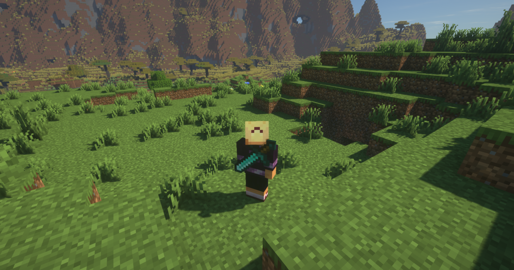
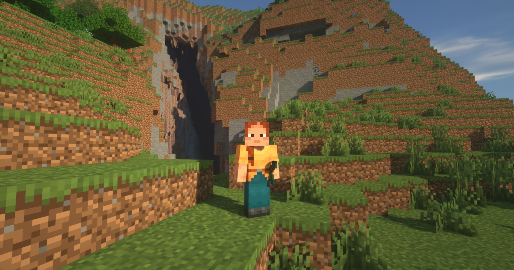

# BackTools

A Fabric mod that renders the last used tool in player's back and other clients are able to see it.
You can change any orientation or disable any tool in the config file.

## Screenshots





## How to config

The config file is located in `config/backtools.json5`, and looks like this:

```json5
{
  /* 
	   These options affect only the client that loads the mod.
	   It is not possible to override the environment of the mod.
	*/
  environment: "CLIENT",
  // What items should render on your belt.
  beltTools: [],
  // Enabled tools, by their resource name. Eg: minecraft:diamond_hoe. Putting any entry in here converts       BackTools to a whitelist-only mod. Disabled Tools will be ignored.
  enabledTools: [],
  // Disabled tools, by their resource name. Eg: minecraft:diamond_hoe
  disabledTools: [],
  // Tool orientation, by class file and degrees. Separate with ":" . See defaults for examples.
  toolOrientation: [
    "net.minecraft.item.ToolItem:0",
    "net.minecraft.item.HoeItem:0",
    "net.minecraft.item.FishingRodItem:0",
    "net.minecraft.item.TridentItem:0",
    "net.minecraft.item.RangedWeaponItem:90",
  ],
  // Get in swimming position and your tools go "Weeee"
  helicopterMode: false,
}
```

## Options

- `beltTools` - Any tool in this list will be rendered on your belt instead. (e.g minecraft:diamond_sword)
- `enabledTools` - Whitelist of tools to render. If this list is not empty, only tools in this list will be rendered.
- `disabledTools` - Blacklist of tools to render. If this list is not empty, tools in this list will not be rendered.
- `toolOrientation` - Orientation of tools, by class file and degrees. Separate with ":" . See defaults for examples.
- `helicopterMode` - Enables the original "helicopter mode" (easter egg), where your tools spin around you when you swim, fly, or elytra.

## Setup

For setup instructions please see the [fabric wiki page](https://fabricmc.net/wiki/tutorial:setup) that relates to the IDE that you are using.
